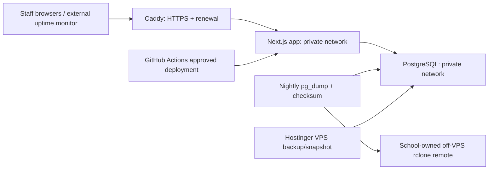

# Production Operator Runbook

This runbook is for the school operator responsible for the Hostinger VPS. It explains how to operate the application without exposing secrets or treating a CSV export as a full backup. Complete the launch checklist before accepting real school records.

## Ownership before provisioning

The school, not an individual developer, must control:

- the Hostinger account, VPS billing, backup plan, and recovery access;
- the domain/DNS account and `records.<school-domain>` hostname;
- the Hostinger mailbox for future password-reset mail;
- the off-VPS backup storage account and its `rclone` credentials;
- the GitHub repository `production` environment, deployment approval, and package access;
- the alert webhook, external uptime monitor, and incident contacts;
- the password manager entry for every recovery credential.

Record two operators who can access each item. Do not store credentials in this repository, GitHub issues, shell history, or chat.

## What runs on the VPS



Only Caddy accepts public traffic on ports 80 and 443. The PostgreSQL and application services have no public host port. Caddy stores TLS state in a Docker volume; PostgreSQL stores data in its own Docker volume.

## First provisioning

1. Create an Ubuntu LTS VPS in the selected Brazilian location. Keep Hostinger automatic VPS backups enabled; choose daily if the plan and school budget allow it.
2. Create a dedicated `school-records-deploy` user. Use one ED25519 SSH key for deployments and separate break-glass access held by the school. Disable password SSH login after key access works. Docker-group membership is operationally powerful, so restrict this account, its key, and GitHub environment access.
3. Install Docker Engine, the Docker Compose plugin, Git, `curl`, `python3`, `rclone`, and PostgreSQL client utilities. Confirm `docker compose version`, `rclone version`, and `systemctl` work.
4. Configure the provider firewall and UFW to allow only SSH from approved administrator IPs where possible, plus public TCP 80 and 443. Do not open 5432, 3000, or any PostgreSQL port.
5. Clone the repository to `/opt/school-records-platform/current` as the deployment user. Do not place the production environment file inside the Git clone.
6. Copy `.env.production.example` to `/etc/school-records-platform/production.env`, fill each placeholder, then set `sudo chown root:school-records-deploy` and `sudo chmod 0640` on it. Generate secrets with a password manager or `openssl rand -base64 48`; URL-encode database-password characters used inside connection URLs.
7. Configure `rclone` as the deployment user for a school-owned remote. Use a remote folder dedicated to this application. Set `RCLONE_REMOTE` and keep `REQUIRE_OFFSITE_BACKUP=true`.
8. Create the GitHub `production` environment, restrict deployments to the intended branch, require human approval where the school plan supports it, and add `PRODUCTION_SSH_HOST`, `PRODUCTION_SSH_PORT`, `PRODUCTION_SSH_USER`, `PRODUCTION_SSH_PRIVATE_KEY`, and `PRODUCTION_SSH_KNOWN_HOSTS` as environment secrets. Set `PRODUCTION_DOMAIN` as an environment variable. Give the VPS a package-read credential for the private GHCR image, if the package is private.

## DNS, HTTPS, and first deployment

1. Create an A record for the production hostname pointing to the VPS public IPv4 address. Wait for propagation.
2. Confirm public TCP 80 and 443 reach the VPS. Caddy needs both for HTTP-to-HTTPS redirects and certificate issuance. Caddy automatically manages HTTPS when the hostname is present and reachable; see the [Caddy HTTPS quick start](https://caddyserver.com/docs/quick-starts/reverse-proxy).
3. From GitHub, run **Deploy production** and approve the protected environment. The workflow runs source checks, builds immutable SHA-tagged app and migration images, and SSHs to the server-side `ops/deploy.sh`.
4. On the VPS, watch `docker compose --env-file /etc/school-records-platform/production.env -f docker-compose.production.yml ps` and `docker compose --env-file /etc/school-records-platform/production.env -f docker-compose.production.yml logs -f --tail 100`.
5. Confirm `curl -fsS https://records.<school-domain>/api/health/live` returns `{"status":"ok"}`. Do not expose or rely on readiness details publicly.
6. Install timers: copy `ops/systemd/*.service` and `*.timer` to `/etc/systemd/system/`, then run `sudo systemctl daemon-reload`, `sudo systemctl enable --now school-records-backup.timer school-records-backup-check.timer school-records-monitor.timer school-records-restore-rehearsal.timer`, and check `systemctl list-timers 'school-records-*'`.

The deployment runs migrations before bringing up the new application. On its first run there is no existing data volume to back up; every later deployment takes a verified backup before migrations. It never runs the local seed command.

## Normal deployment and rollback

Use the approved GitHub workflow for every normal deployment. Do not SSH in to change application source files. The workflow publishes immutable images for the exact Git SHA, and `ops/deploy.sh` rejects a dirty server checkout, serializes deployments, verifies health, and alerts on failure.

If a deployment fails before migrations, inspect the workflow and container logs, fix the issue, and deploy a corrected revision. If it fails after migrations, stop and assess data/schema compatibility. Do not run a destructive migration rollback.

To roll back only the application image after compatibility review:

```bash
cd /opt/school-records-platform/current
ENV_FILE=/etc/school-records-platform/production.env ./ops/rollback-app.sh
```

The script uses the last recorded image and waits for readiness. It does **not** reverse database migrations. If the prior app cannot safely use the migrated schema, restore planning is an incident decision, not an automatic command.

## Restarts, security updates, and reboots

Docker services use `unless-stopped`, so they return after Docker/host restarts. After a controlled reboot, run:

```bash
cd /opt/school-records-platform/current
ENV_FILE=/etc/school-records-platform/production.env ./ops/restart.sh
```

Use Ubuntu’s supported unattended security updates for routine patches, but choose a documented monthly maintenance window for kernel, Docker, or package updates that may require a reboot. Before a reboot, check the latest backup and service health. After it, run `ops/restart.sh`, verify public liveness, and complete the release smoke test. Never schedule automatic reboot behavior without the school approving its downtime window.

## Monitoring and logs

- `school-records-monitor.timer` checks the PostgreSQL, application, and Caddy containers every five minutes, plus Docker CPU/memory and host disk/memory thresholds. It sends a generic JSON webhook alert when configured.
- `school-records-backup-check.timer` verifies that the last backup is recent, has a matching checksum, and has verified off-VPS status.
- Configure a school-owned external uptime monitor for `https://records.<school-domain>/api/health/live`. This is the independent check for internet reachability and certificate problems.
- Inspect logs with `docker compose --env-file /etc/school-records-platform/production.env -f docker-compose.production.yml logs --tail 200 app`, replacing `app` with `postgres` or `caddy` when needed. Logs are bounded; export incident evidence promptly.

If disk usage is high, first check `df -h`, Docker images/volumes, and old backup archives. Do not delete the active PostgreSQL volume. Follow the retention policy, confirm an off-VPS copy exists, then remove only old eligible logical archives or unused images. If PostgreSQL is down, stop deploy attempts, inspect its logs and disk space, preserve the volume, and restore into a temporary database before considering production replacement.

## Backup, restore, and rehearsal

Nightly `pg_dump` archives are compressed, checksummed, and copied to the configured off-VPS remote. Hostinger VPS backups are an additional layer. The default logical retention is 30 days, pending school cost approval.

To run a manual backup before a high-risk maintenance task:

```bash
cd /opt/school-records-platform/current
ENV_FILE=/etc/school-records-platform/production.env ./ops/backup-postgres.sh manual
ENV_FILE=/etc/school-records-platform/production.env ./ops/check-backup.sh
```

To rehearse recovery safely:

```bash
ENV_FILE=/etc/school-records-platform/production.env ./ops/restore-rehearsal.sh
```

It restores the latest archive to a new temporary database, verifies representative accounts, classes, attendance/homework, grades, risk data, imports, substitutions/work records, bonus classes, and personal bookings, then removes the temporary database. The school must run this successfully with its actual backup destination before launch and at least quarterly thereafter.

For a real incident, first stop new record entry, preserve the damaged volume, identify the backup timestamp, restore using `ops/restore-postgres.sh <archive> <new-temporary-db>`, inspect the temporary database, and get a named school decision before replacing any production data. Never restore directly over the production database.

## Credential loss and rotation

If a deployment key is lost, revoke it in GitHub and on the VPS, create a new key, update the production environment secret and server `authorized_keys`, then test a deployment approval. Rotate database passwords and `AUTH_SECRET` through the protected environment file in a maintenance window; remember that changing `AUTH_SECRET` signs out all users. Rotate the `rclone` credential and alert webhook with their providers, then run a backup and freshness check.

## Password-reset SMTP status

SMTP delivery is not yet implemented and therefore cannot be tested here. The next focused work must use a school-owned Hostinger mailbox, verify SPF/DKIM/DMARC, configure `smtp.hostinger.com` through protected variables, and perform a real delivery test without logging tokens or passwords. Until then, password reset is a launch blocker.

## Launch checklist and recurring maintenance

Before launch, confirm all of the following: school ownership is recorded; public DNS/TLS works; only SSH/80/443 are open; PostgreSQL has no public port; production secrets are protected; GitHub production approval works; a deployment passed; an external uptime alert works; Hostinger backups are enabled; an off-VPS dump/checksum exists; a real restore rehearsal passed; incident contacts exist; and the normal admin/teacher/reception smoke test passes in English and Brazilian Portuguese.

Every month, review VPS updates, Docker image updates, disk growth, timer history, backup age, alert delivery, and deployment access. Every quarter, rehearse a restore and review off-VPS retention/cost. At least annually, rotate recovery credentials and confirm the school—not a former staff member—controls every account.
